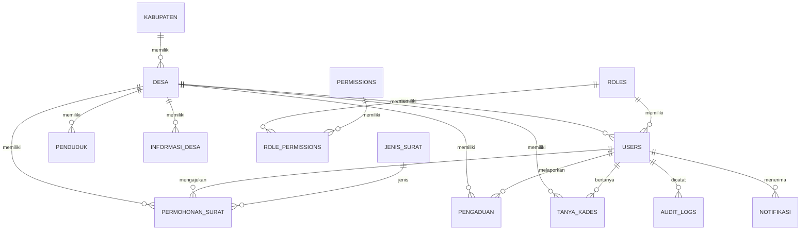

# SiPelayan-Desa — Rancangan Teknis & Arsitektur Sistem

> **Senior Full-Stack Software Architect · GovTech UI/UX Expert · Cybersecurity Specialist**
> Versi Dokumen: 1.0 | Tanggal: 11 Agustus 2026

---

## Ringkasan Eksekutif

**SiPelayan-Desa** adalah platform pelayanan publik berbasis web multi-tenant untuk melayani ribuan desa lintas kabupaten/kota. Target: **10.000+ pengguna aktif** dengan isolasi data ketat antar tenant.

**Stack Teknologi:** PHP 8.2+ (CodeIgniter 4) · MySQL 8.0 · Bootstrap 5 · jQuery/AJAX · Redis Cache

---

## 1. Arsitektur Sistem

### 1.1 Diagram Arsitektur

```
┌─────────────────────────────────────────────────────────────────────┐
│                        INTERNET / CDN                               │
└──────────────────────────┬──────────────────────────────────────────┘
                           │
┌──────────────────────────▼──────────────────────────────────────────┐
│               NGINX Reverse Proxy + SSL Termination                 │
│         Rate Limiting: 100 req/min (Warga), 500 req/min (Operator)  │
└──────────────────────────┬──────────────────────────────────────────┘
                           │
┌──────────────────────────▼──────────────────────────────────────────┐
│              PHP-FPM + CodeIgniter 4 Application Layer              │
│  ┌──────────────┐  ┌──────────────┐  ┌──────────────────────────┐   │
│  │  Auth Module │  │  API Routes  │  │  Web Routes (Bootstrap5) │   │
│  └──────────────┘  └──────────────┘  └──────────────────────────┘   │
│  ┌──────────────────────────────────────────────────────────────┐   │
│  │  Filters: AuthFilter → RoleFilter → TenantFilter → RateLimit│   │
│  └──────────────────────────────────────────────────────────────┘   │
└────────┬──────────────────┬────────────────────┬────────────────────┘
         │                  │                    │
┌────────▼──────┐  ┌────────▼──────┐  ┌──────────▼───────┐
│  MySQL 8.0    │  │  Redis Cache  │  │  File Storage     │
│  (Read/Write) │  │  (Sessions,   │  │  (storage/ dir)   │
│               │  │  Query Cache) │  │  Dokumen Warga    │
└───────────────┘  └───────────────┘  └──────────────────┘
```

### 1.2 Strategi Multi-Tenant: Shared Database + Shared Schema

| Strategi | Dipilih? | Alasan |
|---|---|---|
| Separate Database per Desa | ❌ | Tidak scalable untuk 1000+ desa |
| Shared DB, Separate Schema | ❌ | Kompleks untuk MySQL |
| **Shared DB, Shared Schema + `village_id`** | ✅ | Optimal: satu DB, isolasi via discriminator, mudah rekap kabupaten |

**Aturan Isolasi:**
- Setiap model tenant WAJIB extend `BaseTenantModel` → otomatis inject `WHERE village_id = ?`
- Super Admin bypass filter via `withoutTenantScope()`

### 1.3 Strategi Caching & Optimasi Query

```
Lapisan Caching (Redis/File):
├── L1: Session Cache          → TTL: 2 jam
├── L2: Query Result Cache     → TTL: 5 menit (statistik dashboard)
├── L3: Config/Profile Cache   → TTL: 1 jam (profil desa)
└── L4: Rate Limit Counter     → TTL: sliding window

Optimasi MySQL:
├── Composite Index: (village_id, status, created_at) pada tabel permohonan
├── Covering Index: untuk query laporan/statistik
├── Partisi tabel audit_logs: BY RANGE (YEAR(created_at))
└── Prepared Statements: semua query via CI4 Query Builder (anti SQL Injection)
```

---

## 2. Skema Database MySQL

### 2.1 ERD (Entity Relationship Diagram)



### 2.2 Script SQL Lengkap

Script SQL akan dibuat di file [database/sipd_schema.sql](file:///d:/vibe-coding/sipelayan-desa/database/sipd_schema.sql) dengan tabel-tabel:

| Tabel | Deskripsi | Tenant? |
|---|---|---|
| `kabupaten` | Master kabupaten/kota (kode Kemendagri) | ❌ |
| `desa` | Master desa = 1 tenant | ❌ |
| `roles` | 4 role: super_admin, admin_desa, operator, warga | ❌ |
| `permissions` | Daftar permission per modul+aksi | ❌ |
| `role_permissions` | Pivot role ↔ permission | ❌ |
| `users` | Semua pengguna (village_id nullable utk Super Admin) | ✅ |
| `penduduk` | Data kependudukan desa | ✅ |
| `jenis_surat` | Master 12+ jenis surat + form JSON schema | ❌ |
| `permohonan_surat` | Permohonan surat warga (tabel inti) | ✅ |
| `pengaduan` | Pengaduan/tiket warga | ✅ |
| `informasi_desa` | Berita, pengumuman, APBDes | ✅ |
| `tanya_kades` | Tanya jawab ke Kepala Desa | ✅ |
| `audit_logs` | Log audit seluruh aktivitas (partisi per tahun) | ✅ |
| `notifikasi` | Notifikasi in-app per user | ✅ |

---

## 3. Struktur Direktori Proyek

```
sipelayan-desa/
├── app/
│   ├── Config/
│   │   ├── App.php
│   │   ├── Auth.php                 ← Konfigurasi auth khusus
│   │   ├── Filters.php              ← Registrasi filter/middleware
│   │   └── Routes.php               ← Routing utama per role
│   │
│   ├── Controllers/
│   │   ├── BaseController.php
│   │   ├── Auth/
│   │   │   ├── LoginController.php
│   │   │   └── RegisterController.php
│   │   ├── SuperAdmin/
│   │   │   ├── DashboardController.php
│   │   │   ├── KabupatenController.php
│   │   │   └── DesaController.php
│   │   ├── AdminDesa/
│   │   │   ├── DashboardController.php
│   │   │   ├── ProfilDesaController.php
│   │   │   └── PermohonanController.php     ← Approval surat
│   │   ├── Operator/
│   │   │   ├── DashboardController.php
│   │   │   ├── PendudukController.php       ← CRUD kependudukan
│   │   │   └── PermohonanController.php     ← Verifikasi surat
│   │   ├── Warga/
│   │   │   ├── DashboardController.php
│   │   │   ├── PermohonanController.php     ← ★ Pengajuan surat
│   │   │   ├── PengaduanController.php
│   │   │   └── TanyaKadesController.php
│   │   └── Publik/
│   │       ├── BerandaController.php        ← Landing page
│   │       └── InformasiController.php      ← Berita/APBDes publik
│   │
│   ├── Filters/                              ← ★ RBAC Middleware
│   │   ├── AuthFilter.php                   ← Cek sesi login
│   │   ├── RoleFilter.php                   ← Cek role akses
│   │   ├── TenantFilter.php                 ← Isolasi data tenant
│   │   └── RateLimitFilter.php              ← Rate limiting
│   │
│   ├── Models/
│   │   ├── BaseTenantModel.php              ← ★ Abstract: auto village_id scope
│   │   ├── UserModel.php
│   │   ├── DesaModel.php
│   │   ├── KabupatenModel.php
│   │   ├── PendudukModel.php
│   │   ├── JenisSuratModel.php
│   │   ├── PermohonanSuratModel.php
│   │   ├── PengaduanModel.php
│   │   ├── InformasiDesaModel.php
│   │   ├── TanyaKadesModel.php
│   │   ├── AuditLogModel.php
│   │   └── NotifikasiModel.php
│   │
│   ├── Services/                             ← Business Logic Layer
│   │   ├── AuthService.php
│   │   ├── PermohonanService.php
│   │   ├── NotifikasiService.php
│   │   ├── WhatsAppService.php              ← Integrasi WA Kades
│   │   └── AuditService.php
│   │
│   ├── Libraries/
│   │   └── TenantManager.php
│   │
│   ├── Helpers/
│   │   └── sipd_helper.php
│   │
│   └── Views/
│       ├── layouts/
│       │   ├── main.php                     ← Layout dashboard Bootstrap 5
│       │   ├── auth.php                     ← Layout halaman auth
│       │   └── publik.php                   ← Layout landing page
│       ├── components/
│       │   ├── navbar.php
│       │   ├── sidebar.php
│       │   └── alerts.php
│       ├── auth/
│       │   ├── login.php
│       │   └── register.php
│       ├── warga/
│       │   └── permohonan/
│       │       ├── index.php
│       │       ├── buat.php
│       │       ├── detail.php
│       │       └── tracking.php
│       └── publik/
│           └── beranda.php
│
├── public/
│   ├── index.php
│   └── assets/
│       ├── css/
│       │   └── sipd.css                     ← Custom styles
│       ├── js/
│       │   └── sipd.js                      ← Custom scripts
│       └── img/
│
├── storage/                                  ← SENSITIF — di luar public/
│   ├── surat_output/
│   ├── dokumen_warga/
│   └── foto_pengaduan/
│
├── database/
│   └── sipd_schema.sql                      ← DDL lengkap
│
├── writable/
│   ├── cache/
│   ├── logs/
│   └── session/
│
├── .env
├── .htaccess
└── composer.json
```

---

## 4. Proposed Changes — File yang Akan Dibuat

### Fase 1: Foundation (Database + CI4 Skeleton)

#### [NEW] database/sipd_schema.sql
- DDL lengkap 14 tabel + seed data roles & jenis surat
- Composite indexes optimal untuk multi-tenant queries

#### [NEW] CI4 Project via Composer
- `composer create-project codeigniter4/appstarter .`
- Konfigurasi `.env` (database, base URL, environment)

---

### Fase 2: Core Models & Filters (RBAC)

#### [NEW] app/Models/BaseTenantModel.php
- Abstract model dengan auto `WHERE village_id = ?` scope
- Method `withoutTenantScope()` untuk Super Admin
- Method `forVillage(int $id)` untuk query spesifik desa

#### [NEW] app/Filters/AuthFilter.php
- Cek session login aktif
- Validasi akun aktif, tidak banned, tidak locked

#### [NEW] app/Filters/RoleFilter.php
- RBAC role checking dari argument route filter
- Support multi-role: `role:admin_desa,super_admin`
- Response 403 JSON untuk AJAX, redirect untuk web

#### [NEW] app/Filters/TenantFilter.php
- Validasi village_id session vs URL parameter
- Logging cross-tenant attempt sebagai security anomaly
- Super Admin bypass

#### [NEW] app/Filters/RateLimitFilter.php
- Sliding window rate limiting via cache
- Configurable limit:window per route

#### [MODIFY] app/Config/Filters.php
- Registrasi semua filter custom

---

### Fase 3: Controllers & Views (Core Modules)

#### [NEW] app/Controllers/Auth/LoginController.php
- Login dengan Argon2id/Bcrypt password verification
- Brute-force protection (lock setelah 5x gagal)

#### [NEW] app/Controllers/Auth/RegisterController.php
- Registrasi warga mandiri + email verification

#### [NEW] app/Controllers/Warga/PermohonanController.php ★
- `index()` — Riwayat permohonan warga
- `buat()` — Form dinamis berdasarkan jenis surat (JSON schema)
- `simpan()` — Validasi + sanitasi + upload dokumen + anti-duplikat
- `detail($id)` — Detail & timeline status
- `tracking($no)` — Tracking publik via nomor permohonan
- `cancel($id)` — Pembatalan oleh warga

#### [MODIFY] app/Config/Routes.php
- Routing per role group dengan filter chain

#### [NEW] app/Views/ (Bootstrap 5 layouts + halaman utama)
- Layout responsive mobile-first
- Dashboard warga, form permohonan, tracking

---

### Fase 4: Supporting Services & All Models

#### [NEW] Semua Model (14 model)
#### [NEW] app/Services/PermohonanService.php
- Generate nomor permohonan unik
- Alur approval berjenjang: Operator → Admin Desa

#### [NEW] app/Services/AuditService.php
- Logging audit trail otomatis

---

## 5. Rekomendasi Keamanan Ekstra

| Layer | Implementasi |
|---|---|
| **Password** | Argon2id (PHP `PASSWORD_ARGON2ID`) — memory-hard, anti GPU brute-force |
| **Session** | HTTPOnly + Secure + SameSite=Strict cookies; regenerate ID setiap login |
| **CSRF** | CI4 CSRF filter aktif untuk semua POST/PUT/DELETE |
| **SQL Injection** | Query Builder + Prepared Statements (zero raw query) |
| **XSS** | `esc()` helper di semua output view; CSP headers |
| **Rate Limiting** | Per-endpoint sliding window (login: 5/5min, form: 10/min) |
| **File Upload** | Whitelist MIME (pdf,jpg,png), max 5MB, rename hash, simpan di luar public/ |
| **Data Sensitif** | NIK/No KK di-mask pada API response; enkripsi at-rest untuk dokumen KTP |
| **Audit Trail** | Semua operasi CRUD dicatat ke `audit_logs` dengan old/new data snapshot |
| **Brute-Force** | Akun lock 30 menit setelah 5x percobaan gagal |
| **Tenant Isolation** | Cross-tenant attempt terdeteksi & dicatat sebagai security incident |
| **Headers** | `X-Content-Type-Options: nosniff`, `X-Frame-Options: DENY`, `Strict-Transport-Security` |

---

## 6. Verification Plan

### Automated
```bash
# Cek CI4 project valid
php spark serve

# Cek database schema
mysql -u root -p < database/sipd_schema.sql

# Cek routes terdaftar
php spark routes
```

### Manual
- Akses landing page di browser
- Test login flow
- Verifikasi RBAC filter blocking unauthorized access
- Test form permohonan surat (submit + tracking)

---

> [!IMPORTANT]
> **Estimasi file yang akan dibuat: ~35 file** termasuk SQL schema, models, controllers, filters, services, views, dan assets CSS/JS. Semua file menggunakan **best practices CI4** dengan keamanan berlapis.

> [!NOTE]
> Proyek akan di-scaffold menggunakan `composer create-project codeigniter4/appstarter` kemudian dimodifikasi sesuai arsitektur di atas. Pastikan PHP 8.2+, Composer, dan MySQL 8.0 sudah terinstall di sistem Anda.
